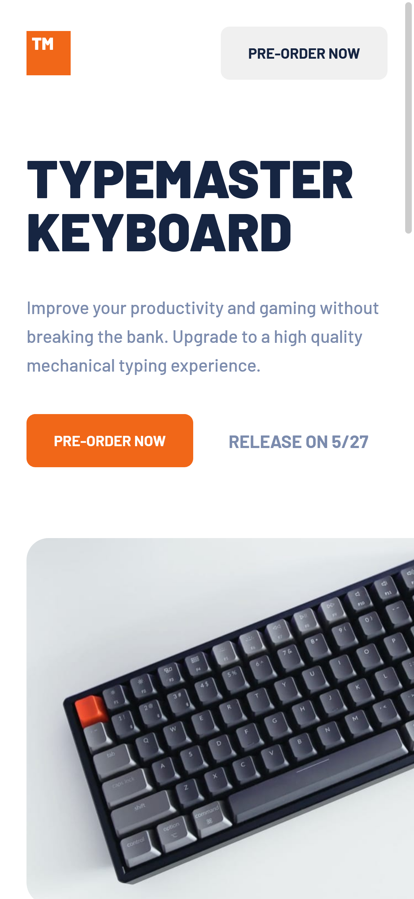

# Frontend Mentor - Typemaster pre-launch landing page solution

This is a solution to the [Typemaster pre-launch landing page challenge on Frontend Mentor](https://www.frontendmentor.io/challenges/typemaster-prelaunch-landing-page-J6-Yj5J-X). Frontend Mentor challenges help you improve your coding skills by building realistic projects.

## Table of contents

- [Frontend Mentor - Typemaster pre-launch landing page solution](#frontend-mentor---typemaster-pre-launch-landing-page-solution)
  - [Table of contents](#table-of-contents)
  - [Overview](#overview)
    - [Screenshot](#screenshot)
    - [Links](#links)
  - [My process](#my-process)
    - [Built with](#built-with)
    - [What I learned](#what-i-learned)
    - [Continued development](#continued-development)
    - [Useful resources](#useful-resources)
  - [Author](#author)

## Overview

### Screenshot



### Links

- [GitHub Repo](https://github.com/vincitaylaran/typemaster-prelaunch-landing-page)
- [Live Demo](https://reverent-booth-6c08e5.netlify.app/) 🎉

## My process

### Built with

- Semantic HTML5 markup
- CSS custom properties
- Flexbox
- CSS Grid
- Mobile-first workflow
- [React](https://reactjs.org/) - JS library
- [Gatsby.js](https://www.gatsbyjs.com/) - React framework
- [Styled Components](https://styled-components.com/) - For styles

### What I learned

#### Gatsby Image

This plugin handles producing images in multiple sizes.

When you install the gatsby image plugn via `npm install gatsby-plugin-image`, you can import your image similar to a module and pass it to the `src` prop.

```jsx
import PhoneAndKeyboardMobileImg from "../images/mobile/image-phone-and-keyboard.jpg"

const Image = () => 
```

In order to appreciate this plugin, lets say the image above was 1024px wide. If you were to view this on your phone and without a wifi connection, loading this entire image is definitely not a good thing as it will eat into the client's data plan. This plugin will check the width of the viewport and load the appropriate size.

#### Image Filter

Not to be confused with the `filter` CSS property.

```jsx
import styled from "styled-components"

const Container = styled.div`
  background: #f16718;

  img {
    mix-blend-mode: multiply;
    opacity: 0.75;
  }
`
```

The above code will apply an orange overlay to its `img` child element.

### Continued development

This project has made me interested in image optimization and learning how to prevent underfetching or overfetching data. Apparently a querying language called [GraphQL](https://graphql.org/) fixes this issue. I will learn this language and use it as my backend for this [frontend challenge by Frontend Mentor](https://www.frontendmentor.io/challenges/invoice-app-i7KaLTQjl).

### Useful resources

- [Image overlay](https://22bulbjungle.com/background-image-color-overlay-create-a-filter-look-with-css/) - This gem of an article helped me with the orange overlay that you see image with the phone and keyboard.

## Author

- Website - [Vinci Taylaran](https://www.vincitaylaran.com/)
- Frontend Mentor - [@vincitaylaran](https://www.frontendmentor.io/profile/vincitaylaran)
- LinkedIn - [Vinci Taylaran](https://www.linkedin.com/in/vinci-taylaran/)
